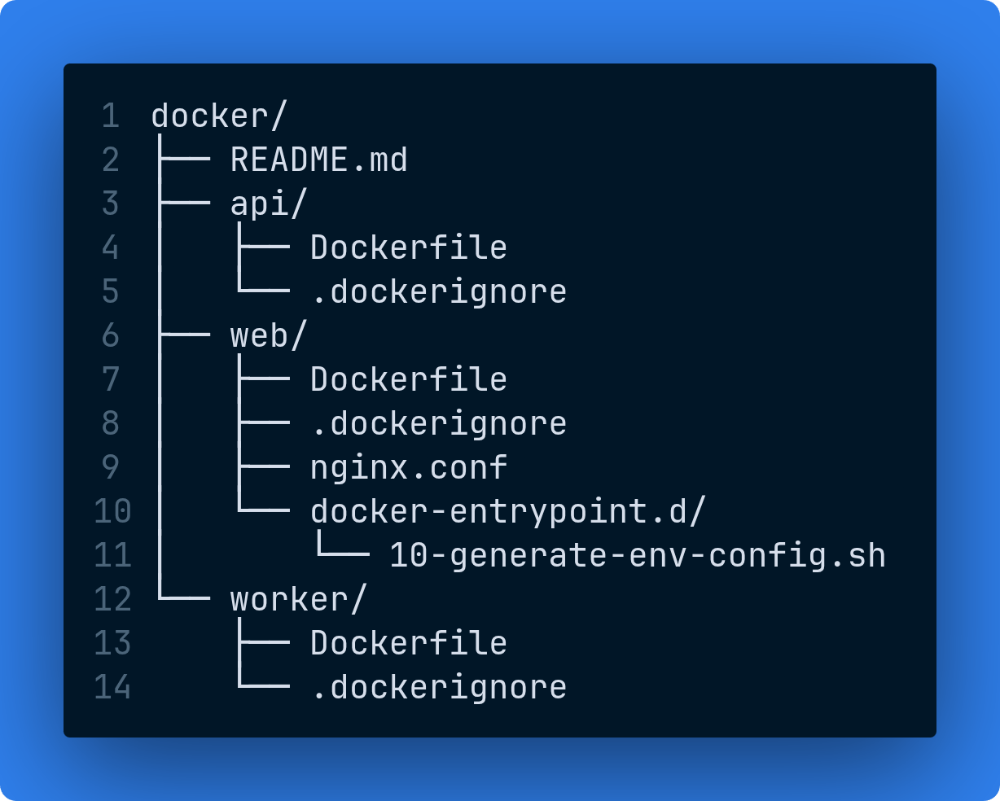

# Docker - Containerização

Corresponde à **Parte 3** do teste técnico.

Esta seção atende ao seguinte requisito do enunciado:

> **Explique:** Como organizaria os Dockerfiles da solução.
> **Mostre:**
>
> * multi-stage build;
> * redução de tamanho das imagens;
> * boas práticas de segurança;
> * gerenciamento de variáveis de ambiente.

**Premissa assumida:** o cenário do teste é hipotético e não há código-fonte real da aplicação. O próprio enunciado pede *"Dockerfiles (exemplo)"*. Os arquivos aqui assumem uma estrutura de projeto convencional (`src/Api`, `src/Worker`, `package.json` na raiz) e são funcionais, bastaria o código real na estrutura esperada para que buildassem. Todos passam sem avisos no [hadolint](https://github.com/hadolint/hadolint).

## Organização dos Dockerfiles

**Cada Dockerfile pertence ao repositório da aplicação que ele empacota, não a um repositório central de infraestrutura.**

No cenário original há quatro repositórios no Azure DevOps (`api`, `web`, `worker`, `infrastructure`). O Dockerfile depende diretamente da estrutura interna do projeto: caminho do `.csproj`, nome do assembly, diretório de saída do build. Se alguém renomeia `src/Api` para `src/Api.Host`, o Dockerfile quebra.

Mantendo-o no mesmo repositório, a alteração de estrutura e a correção do Dockerfile acontecem **no mesmo Pull Request, sob a mesma revisão**. Se o Dockerfile vivesse em `infrastructure`, seriam dois Pull Requests em repositórios diferentes que precisam ser mesclados em ordem, e o build fica quebrada no intervalo.

> Neste repositório de entrega, os três Dockerfiles estão agrupados sob `docker/` apenas para facilitar a avaliação.

### Estrutura do diretório



## `api/Dockerfile`

**Finalidade:** empacota a API REST em .NET 10, que é o componente central da solução, recebe as requisições do front-end, acessa SQL Database e Redis, publica mensagens na fila consumida pelo Worker e integra com o Azure OpenAI.

No ambiente provisionado, esta imagem é publicada no Azure Container Registry pela pipeline e executada como Container App com **ingress interno** (acessível apenas pelo front-end dentro do Container Apps Environment, nunca diretamente pela internet).

### Estrutura em três estágios

| Estágio   | Imagem base                         | Papel                                     |
| --------- | ----------------------------------- | ----------------------------------------- |
| `restore` | `dotnet/sdk:10.0-noble`             | Resolve as dependências NuGet             |
| `publish` | herda de `restore`                  | Compila e gera os artefatos publicados    |
| `final`   | `dotnet/aspnet:10.0-noble-chiseled` | Recebe **apenas** os artefatos compilados |

### A parser directive da primeira linha

```dockerfile
# syntax=docker/dockerfile:1.7
```

Apesar da aparência, **não é um comentário**: é uma *parser directive* lida pelo BuildKit antes do parsing do arquivo. Ela fixa a versão da sintaxe do Dockerfile e habilita recursos modernos como `COPY --chmod`. Precisa ser a primeira linha do arquivo.

### Por que o restore é um estágio separado?

O ganho do multi-stage não está só em separar build de runtime, está em **ordenar as instruções pela frequência com que mudam**:

```dockerfile
COPY ["src/Api/Api.csproj", "src/Api/"]   # muda raramente
RUN dotnet restore ...                     # camada permanece em cache

COPY src/ src/                             # muda a cada commit
RUN dotnet publish ... --no-restore
```

Copiar apenas o `.csproj` antes do código-fonte faz com que a camada de restore permaneça em cache enquanto as dependências não mudarem. Na prática, um build de rotina pula inteiramente o download de pacotes NuGet, normalmente a maior parte do tempo de build.

Se o `COPY src/` viesse antes do restore, **qualquer** alteração de uma linha invalidaria o cache e forçaria o download completo das dependências a cada build.

### Por que a imagem final é chiseled?

`dotnet/aspnet:10.0-noble-chiseled` é uma imagem *distroless*: contém apenas o conjunto mínimo de pacotes que o .NET precisa, **sem shell, sem gerenciador de pacotes e sem utilitários de sistema**. Um atacante que consiga execução de código no container não encontra `bash`, `curl`, `apt` ou `wget` para escalar o ataque. Menos pacotes também significa menos CVEs herdadas do sistema operacional.

O SDK do .NET pesa cerca de 800 MB e não é necessário para *executar* a aplicação, apenas para compilá-la. Com o multi-stage build, esse estágio é descartado e a imagem final fica em torno de **110 MB**.

> **Consequência assumida:** sem shell no container, não é possível declarar `HEALTHCHECK` baseado em `curl` nem depurar com `docker exec`. O health check é configurado como *probe* do Container Apps, executado pela plataforma e não de dentro do container. Isso é preferível: a plataforma passa a ser a fonte de verdade sobre a saúde da réplica.

### Decisões linha a linha

| Instrução                                     | Motivo                                                                                                                                                     |
| --------------------------------------------- | ---------------------------------------------------------------------------------------------------------------------------------------------------------- |
| `ARG DOTNET_VERSION=10.0`                     | Versão parametrizada no topo, atualizar a versão do .NET é mudar uma linha, não caçar ocorrências pelo arquivo                                             |
| `--runtime linux-x64` no restore e no publish | Restaura e publica para um runtime específico, permitindo `--no-restore` no publish sem refazer o trabalho                                                 |
| `--self-contained false`                      | A imagem base já contém o runtime .NET; empacotá-lo novamente duplicaria ~70 MB                                                                            |
| `-p:PublishReadyToRun=true`                   | Pré-compila IL para código nativo. **Aumenta** a imagem em alguns MB, mas reduz o tempo de startup, ver justificativa abaixo                               |
| `-p:Version=${VERSION}`                       | Versão injetada pela pipeline, tornando a versão do assembly rastreável até o build que a gerou                                                            |
| `ENV ASPNETCORE_HTTP_PORTS=8080`              | Porta não privilegiada (>1024): processos não-root não podem fazer bind abaixo de 1024                                                                     |
| `ENV DOTNET_EnableDiagnostics=0`              | Desliga o diagnostic server (usado por `dotnet-trace`/`dotnet-dump`), que é superfície de ataque desnecessária fora de desenvolvimento                     |
| `COPY --chown=$APP_UID:$APP_UID`              | Arquivos já entram com o dono correto, evitando um `RUN chown` que criaria uma camada adicional duplicando o conteúdo                                      |
| `USER $APP_UID`                               | Executa como usuário sem privilégios. `$APP_UID` (1654) é definido pelas imagens base oficiais do .NET                                                     |
| `ENTRYPOINT ["dotnet", "Api.dll"]`            | Forma *exec* (não *shell*): o processo roda como PID 1 e recebe `SIGTERM` diretamente, permitindo shutdown gracioso quando o Container Apps reduz réplicas |

### Sobre `PublishReadyToRun` e o scale-to-zero

Esta flag aumenta o tamanho da imagem em alguns MB em troca de um startup mais rápido, uma escolha que só faz sentido à luz do dimensionamento definido em [`sizing/`](../sizing/README.md#escalabilidade-automática).

Como os Container Apps operam com **scale-to-zero** em homologação, toda requisição após um período de ociosidade dispara um *cold start*. Trocar alguns MB de imagem por menos tempo de inicialização é vantajoso nesse cenário. Em um serviço com réplica sempre ativa (`min_replicas = 1`), o cálculo poderia ser diferente.

### Como buildar

```bash
docker build -f docker/api/Dockerfile \
  --build-arg VERSION=1.0.0 \
  -t acracdahomolog.azurecr.io/api:1.0.0 .
```

O build context é a **raiz do repositório `api`**, não o diretório `docker/api/`, por isso o `.` no final e o `-f` apontando para o caminho do Dockerfile. Os caminhos dentro do arquivo (`src/Api/...`) são relativos a essa raiz.

No pipeline, esse build é executado pelo template `docker-build-push.yaml`, que também faz o push para o Azure Container Registry, ver [`pipelines/`](../pipelines/README.md).

## `api/.dockerignore`

**Finalidade:** define o que **não** é enviado ao daemon do Docker quando o build começa. Atende diretamente a dois dos quatro itens que o enunciado pede para demonstrar: *redução de tamanho das imagens* e *boas práticas de segurança*.

### Como funciona o build context

Ao executar `docker build ... .`, o Docker empacota **todo o conteúdo do diretório indicado** (o `.`) e envia para o daemon antes de processar qualquer instrução do Dockerfile. Sem `.dockerignore`, isso inclui `bin/`, `obj/`, o histórico completo do `.git` e qualquer arquivo de configuração local mesmo que o Dockerfile nunca use nada disso.

O impacto é duplo:

| Problema                 | Consequência                                                                                           |
| ------------------------ | ------------------------------------------------------------------------------------------------------ |
| Contexto grande          | Cada build gasta tempo empacotando e transferindo centenas de MB desnecessários                        |
| Invalidação de cache     | Um `COPY . .` copia arquivos irrelevantes; alterar qualquer um deles invalida a camada e força rebuild |
| **Vazamento de segredo** | Um `appsettings.Development.json` com senha entra na imagem e vai parar no registry                    |

### O bloco mais importante

```yaml
**/appsettings.Development.json
**/appsettings.Local.json
**/*.user
**/secrets.json
**/.env
**/.env.*
**/*.pfx
**/*.key
**/*.pem
```

Esta é a primeira barreira contra credenciais entrando na imagem. O risco é real e silencioso: `appsettings.Development.json` costuma conter connection strings com senha para o banco local, e nada no processo de build avisa que ele foi copiado. Uma vez dentro de uma camada da imagem, o valor é recuperável por qualquer pessoa com acesso de pull ao registry, inclusive se uma camada posterior "apagar" o arquivo, já que a camada anterior continua no histórico.

Os padrões `*.pfx`, `*.key` e `*.pem` cobrem certificados e chaves privadas, que ocasionalmente ficam no diretório do projeto durante desenvolvimento local.

> Esta é a **primeira** de três camadas de proteção. As outras duas são: nenhum `ARG`/`ENV` carregando segredo (ver seção sobre variáveis de ambiente) e injeção em runtime a partir do Key Vault via Managed Identity (ver [`security/`](../security/README.md)).

### Os demais blocos

| Bloco                                          | Motivo                                                                                                                                                                                                      |
| ---------------------------------------------- | ----------------------------------------------------------------------------------------------------------------------------------------------------------------------------------------------------------- |
| `**/bin/`, `**/obj/`, `**/out/`, `**/publish/` | Artefatos de build da máquina local. Além de inúteis, podem **conflitar** com o build dentro do container — um `obj/` gerado com outro RID ou versão de SDK causa erros de restore difíceis de diagnosticar |
| `.git/`                                        | O histórico completo do repositório frequentemente é a maior pasta do projeto, e nada do build depende dele                                                                                                 |
| `azure-pipelines*.yaml`, `.github/`            | Definições de CI não fazem parte da aplicação                                                                                                                                                               |
| `.vs/`, `.vscode/`, `.idea/`                   | Configuração de IDE, específica de cada desenvolvedor                                                                                                                                                       |
| `**/Dockerfile*`, `**/docker-compose*.yml`     | O Dockerfile é lido pelo `-f`, não precisa estar dentro do contexto                                                                                                                                         |
| `**/*.md`, `docs/`                             | Documentação não entra em imagem de runtime                                                                                                                                                                 |
| `**/*Tests/`, `**/*.Tests/`                    | Projetos de teste são compilados e executados na pipeline, em etapa anterior ao build da imagem. A imagem de runtime não deve conter código de teste                                                        |

### Sobre a sintaxe

O padrão `**/` faz o match em qualquer nível de diretório. Escrever `bin/` sozinho excluiria apenas um `bin` na raiz do contexto; `**/bin/` cobre `src/Api/bin`, `src/Shared/bin` e assim por diante  necessário em soluções .NET com múltiplos projetos.

### Relação com o Dockerfile

O `.dockerignore` é o que torna seguro usar `COPY src/ src/` no estágio de publish. Sem ele, essa instrução arrastaria `bin/`, `obj/` e arquivos de configuração local junto com o código-fonte.

Vale notar que o `.dockerignore` **precisa estar na raiz do build context**, não ao lado do Dockerfile. Como o build é executado a partir da raiz do repositório `api`, este arquivo vive lá  aqui em `docker/api/` ele está apenas agrupado para facilitar a avaliação.

## `worker/Dockerfile`

**Finalidade:** empacota o Background Worker em .NET, responsável pelo processamento assíncrono. No fluxo da solução, a API publica mensagens em uma Storage Queue e o Worker as consome  desacoplando operações demoradas (processamento de arquivos enviados, chamadas ao Azure OpenAI, geração de relatórios) do ciclo de requisição/resposta HTTP.

No ambiente provisionado, esta imagem roda como Container App **sem ingress**, escalando por profundidade de fila via KEDA.

### Duas diferenças deliberadas em relação à API

Os dois Dockerfiles são propositalmente parecidos nos estágios de restore e publish  são projetos .NET com o mesmo ciclo de build. As diferenças estão no estágio final, e ambas decorrem do mesmo fato: **o Worker não expõe HTTP**.

#### 1. Imagem base `runtime` em vez de `aspnet`

| Componente | Imagem final                         | Contém                                |
| ---------- | ------------------------------------ | ------------------------------------- |
| API        | `dotnet/aspnet:10.0-noble-chiseled`  | Runtime .NET + ASP.NET Core Framework |
| Worker     | `dotnet/runtime:10.0-noble-chiseled` | Apenas o runtime .NET                 |

O ASP.NET Core Framework existe para servir HTTP: Kestrel, middleware pipeline, roteamento, model binding. Um Worker que apenas consome fila não usa nada disso. Herdar de `aspnet` carregaria cerca de **20 MB** de framework que nunca seria executado e, do ponto de vista de segurança, código não utilizado ainda é superfície de ataque.

A imagem final fica em torno de **90 MB**, contra ~110 MB da API.

> Este é o tipo de decisão que evidencia que os Dockerfiles foram pensados por componente, e não copiados entre si. Um `docker/worker/Dockerfile` idêntico ao da API funcionaria, só seria maior e menos justificável.

#### 2. Ausência de `EXPOSE` e de `ASPNETCORE_HTTP_PORTS`

A API declara `EXPOSE 8080` e define a porta do Kestrel. O Worker não declara porta alguma, porque não escuta em nenhuma.

Isso tem reflexo direto no provisionamento: no Container Apps, o Worker é criado **sem configuração de ingress**. Declarar uma porta que o processo não escuta criaria uma inconsistência entre a imagem e a infraestrutura  e, pior, poderia levar alguém a configurar um health probe HTTP que nunca responderia.

### Como o Worker é monitorado sem endpoint HTTP

Como não há endpoint para um probe HTTP consultar, a saúde do Worker é observada por outros sinais:

| Sinal                   | Origem                                                                                                                                         |
| ----------------------- | ---------------------------------------------------------------------------------------------------------------------------------------------- |
| Processo vivo           | O Container Apps reinicia a réplica se o processo terminar (o `ENTRYPOINT` em forma *exec* garante que o .NET seja o PID 1 e receba os sinais) |
| Profundidade da fila    | Métrica da Storage Queue no Azure Monitor — fila crescendo sem consumo indica Worker travado, mesmo com o processo vivo                        |
| Telemetria da aplicação | Application Insights recebe traces e exceções emitidos pelo próprio Worker                                                                     |

O detalhamento das regras de alerta está em [`observability/`](../observability/README.md).

### Estrutura em três estágios

Idêntica à da API  os motivos de cada decisão (ordenação por frequência de mudança, `--no-restore`, `--self-contained false`, `PublishReadyToRun`, `USER $APP_UID`, forma *exec* do `ENTRYPOINT`) estão explicados na seção [`api/Dockerfile`](#apidockerfile) e não se repetem aqui.

Uma observação sobre `PublishReadyToRun` neste componente especificamente: o ganho de startup é ainda mais relevante para o Worker do que para a API. Com autoscaling por profundidade de fila e `min_replicas = 0`, ele passa a maior parte do tempo desligado e só sobe quando há mensagens acumuladas  cada ciclo de trabalho começa com uma inicialização.

### Como buildar

```bash
docker build -f docker/worker/Dockerfile \
  --build-arg VERSION=1.0.0 \
  -t acracdahomolog.azurecr.io/worker:1.0.0 .
```

Assim como na API, o build context é a **raiz do repositório `worker`**.
