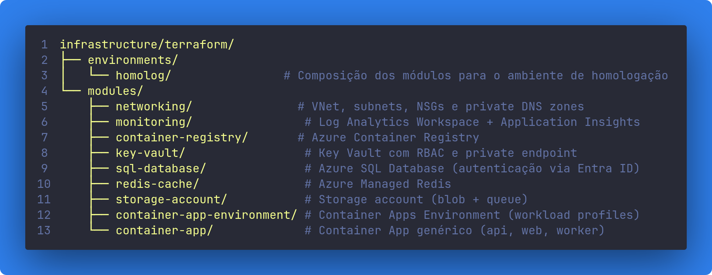

### Infrastructure

Corresponde à **Parte 6** do teste técnico.

Infraestrutura como Código (IaC) do projeto, escrita em **Terraform** para o provedor **Microsoft Azure** (`azurerm`). Provisiona a base necessária para rodar a aplicação em homologação: rede virtual, banco de dados, cache, storage, registry de imagens e o ambiente de Container Apps que hospeda a API, o front-end e o Worker.

A organização segue dois níveis: `modules/`, com um módulo reutilizável por recurso Azure, sem conhecimento dos demais; e `environments/`, onde cada ambiente compõe esses módulos e resolve as dependências entre eles. Hoje existe apenas o ambiente `homolog`, mas a separação permite adicionar outros ambientes reaproveitando os mesmos módulos.

## Estrutura





Cada módulo é independente, versiona seu próprio `versions.tf` e não conhece os demais, toda composição (quem recebe o ID de quem) acontece nos arquivos `main.tf` de `environments/<ambiente>`.

## Convenção dentro de cada módulo

Todo módulo em `terraform/modules/` segue os mesmos quatro arquivos:

- **`main.tf`**: declara os `resources` do módulo (o recurso Azure em si, seu private endpoint e seu diagnostic setting, quando aplicável).
- **`variables.tf`**: entradas do módulo, como nomes, SKUs e IDs de subnet/DNS/Log Analytics recebidos de fora.
- **`outputs.tf`**: valores que o módulo expõe para quem o chama (IDs, nomes, FQDNs, connection strings), usados na composição do ambiente.
- **`versions.tf`**: fixa a versão mínima do `Terraform` e do provider `azurerm`.

## Módulos (`terraform/modules/`)

| Módulo | Responsabilidade |
| --- | --- |
| `networking` | Base de rede do ambiente. Cria a `VNet`, a subnet `snet-container-apps` (delegada a `Microsoft.App/environments`, exige prefixo `/27` ou maior) e a subnet `snet-private-endpoints`, cada uma com seu próprio `NSG`. Também cria as `private DNS zones` (SQL, Redis, Key Vault, Blob, Queue) e os vínculos delas com a VNet. É o módulo do qual todos os outros dependem para obter subnet e DNS zone. |
| `monitoring` | Cria o `Log Analytics Workspace` e o `Application Insights` vinculado a ele. O workspace é usado pelos diagnostic settings dos demais módulos; o Application Insights fornece a connection string consumida pelas aplicações. |
| `container-registry` | Cria o `Azure Container Registry` (nome sem hífen, ex.: `acracdahomolog`) com `admin_enabled = false` (autenticação só via `managed identity`/RBAC). Diferente dos demais módulos com estado, o ACR aceita tráfego público por padrão: privá-lo exige SKU `Premium`, único tier com suporte a `private endpoint`, e o ambiente `homolog` usa `Basic`. Expõe `login_server`, usado pelo pipeline e pelos Container Apps no pull das imagens. |
| `key-vault` | Cria o `Key Vault` com `rbac_authorization_enabled = true`, sem acesso público, resolvido via `private endpoint` na subnet dedicada. Guarda os secrets (connection strings) que os Container Apps consomem. |
| `sql-database` | Cria o `azurerm_mssql_server` e o `azurerm_mssql_database`, com autenticação exclusivamente via **Entra ID** (`azuread_authentication_only = true`) e sem acesso público. Expõe uma `connection_string` sem senha, baseada em `Authentication=Active Directory Default`. |
| `redis-cache` | Cria uma instância de `Azure Managed Redis` (não confundir com o Azure Cache for Redis clássico) sem acesso público, com `private endpoint` e identidade `SystemAssigned`. A porta de conexão é fixa em `10000`. |
| `storage-account` | Cria a `Storage Account` (sem chaves de acesso, `shared_access_key_enabled = false`), um container de blobs para uploads e uma queue consumida pelo `worker`. Tem `private endpoints` separados para `blob` e `queue`. |
| `container-app-environment` | Cria o `Container Apps Environment`, injetado na subnet delegada da VNet, com workload profile `Consumption` e integração com o Log Analytics Workspace. É o ambiente compartilhado onde os Container Apps individuais rodam. |
| `container-app` | Módulo genérico para uma aplicação Container App, reutilizado no ambiente para `api`, `web` e `worker`. Cria uma `user-assigned managed identity` própria por aplicação, atribui as roles `AcrPull` e `Key Vault Secrets User`, e configura imagem, CPU/memória, réplicas, `ingress` (opcional) e regras de escala, por requisições HTTP ou por profundidade de fila (KEDA). O módulo não conhece a storage account: as roles `Storage Blob/Queue Data Contributor` são atribuídas na composição do ambiente, fora do módulo. |

## Ambiente (`terraform/environments/homolog/`)

Composição concreta dos módulos acima para o ambiente de homologação:

- **[`main.tf`](terraform/environments/homolog/main.tf)**: cria o `resource group` e chama cada módulo na ordem de dependência (`networking` → `monitoring` → `container-registry`/`key-vault`/`sql-database`/`redis-cache`/`storage-account` → `container-app-environment` → `container-app` × 3). Também grava os secrets de conexão no Key Vault e cria os `role assignments` de Storage que dependem da identidade de cada Container App. Por isso, essas peças ficam aqui e não dentro dos módulos.
- **[`variables.tf`](terraform/environments/homolog/variables.tf)**: variáveis do ambiente (`subscription_id`, `location`, SKUs, `entra_admin_login`/`entra_admin_object_id`, tags, etc.).
- **[`outputs.tf`](terraform/environments/homolog/outputs.tf)**: valores expostos após o `apply`: login server do ACR, IP/domínio do Container Apps Environment, FQDNs das aplicações, nomes dos Container Apps. Usados pelo pipeline de CI/CD nas etapas de build e deploy.
- **[`providers.tf`](terraform/environments/homolog/providers.tf)**: configuração do provider `azurerm` (incluindo comportamento de soft-delete do Key Vault) e o bloco `backend "azurerm"` (comentado por padrão).
- **[`terraform.tfvars.example`](terraform/environments/homolog/terraform.tfvars.example)**: modelo a ser copiado para `terraform.tfvars` (ignorado pelo Git) com os valores reais do ambiente.

## Padrões adotados

- **Identidade em vez de segredo**: cada Container App recebe uma *user-assigned managed identity* própria, usada para `AcrPull`, leitura de segredos no Key Vault (`Key Vault Secrets User`) e acesso a dados (`Storage Blob/Queue Data Contributor`). Não há chaves de acesso compartilhadas (`shared_access_key_enabled = false` na storage account, `admin_enabled = false` no ACR, SQL exclusivamente com `azuread_authentication_only`).
- **Rede privada por padrão**: SQL Server, Key Vault, Storage Account e Redis não têm acesso público (`public_network_access_enabled = false`) e são resolvidos via *private endpoints* + *private DNS zones* dedicadas na VNet do workload.
- **Nomenclatura**: `<abreviação-do-recurso>-<workload>-<environment>` (ex.: `sql-acda-homolog`), exceto Storage Account e ACR, que não aceitam hífen no nome.
- **Tags**: toda composição de ambiente aplica `workload`, `environment` e `managed_by = terraform` a todos os recursos via `local.tags`.

## Pré-requisitos para deploy

1. **Backend remoto**: o bloco `backend "azurerm"` em [`providers.tf`](terraform/environments/homolog/providers.tf) está comentado. Crie a storage account de state antes do primeiro `terraform init` e descomente o bloco. Sem backend remoto o state fica local, em texto plano, e diverge entre máquinas.
2. **Conectividade privada para o agente de deploy**: como Key Vault, SQL Server e Storage Account não aceitam tráfego público, quem executa `terraform apply` (agente de pipeline ou máquina local) precisa alcançar a VNet do workload, via agente self-hosted na rede, VPN/ExpressRoute ou um Azure DevOps Managed DevOps Pool com VNet injection. Sem isso, os recursos `azurerm_key_vault_secret` e a etapa de criação do banco falham por timeout de rede, mesmo com as permissões RBAC corretas.
3. **Variáveis obrigatórias**: copie [`terraform.tfvars.example`](terraform/environments/homolog/terraform.tfvars.example) para `terraform.tfvars` (já ignorado pelo Git) e preencha `subscription_id`, `location`, `entra_admin_login` e `entra_admin_object_id`.

## Deploy

```bash
cd infrastructure/terraform/environments/homolog
terraform init
terraform plan -out=tfplan
terraform apply tfplan
```
