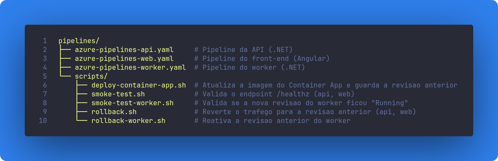

# Pipelines, CI/CD

Corresponde à **Parte 5** do teste técnico.

Pipelines de `CI/CD` em `Azure Pipelines YAML`, uma para cada componente da aplicação: **API**, **Web** e **Worker**. As três seguem a mesma estrutura (build → testes → deploy → smoke test → rollback automático em caso de falha), mudando apenas a stack de build e o Dockerfile usado.

## Estrutura

## Quando cada pipeline executa

As três disparam da mesma forma: a cada push ou Pull Request para `develop`, `main` ou `release/*`. O estágio de **Build** roda sempre, inclusive em PRs, para validar que o código compila e os testes passam antes do merge. Já o estágio de **Deploy** só executa em push (nunca a partir de um PR ainda aberto) para `develop` ou `release/*`, ou seja, o deploy em homologação acontece automaticamente sempre que algo é integrado nessas branches.

## azure-pipelines-api.yaml

**Finalidade:** builda, testa e publica a API (.NET) no ambiente de homologação.

- **Build:** restaura as dependências, compila em `Release` e roda os testes unitários do projeto `Api.Tests`.
- **Deploy:** builda a imagem a partir de `docker/api/Dockerfile`, publica no Azure Container Registry e atualiza o Container App `ca-api-acda-homolog`.
- **Smoke test:** aguarda o endpoint `/healthz` responder `200` após o deploy.
- **Rollback:** se o smoke test falhar, o tráfego volta automaticamente para a revisão anterior.

**Resultado esperado:** nova versão da API publicada em homologação, ou revertida automaticamente se o deploy não passar no smoke test.

## azure-pipelines-web.yaml

**Finalidade:** builda, testa e publica o front-end (Angular) no ambiente de homologação.

- **Build:** instala as dependências (`npm ci`), builda com a configuração `homolog` e roda os testes unitários em modo headless.
- **Deploy:** builda a imagem a partir de `docker/web/Dockerfile` (nginx servindo os arquivos estáticos), publica no ACR e atualiza o Container App `ca-web-acda-homolog`.
- **Smoke test / Rollback:** mesmo mecanismo da API, valida `/healthz` e reverte a revisão em caso de falha.

**Resultado esperado:** nova versão do front-end publicada em homologação, com rollback automático se algo quebrar.

## azure-pipelines-worker.yaml

**Finalidade:** builda, testa e publica o worker (.NET), responsável por consumir mensagens da fila em segundo plano.

- **Build:** restaura as dependências, compila em `Release` e roda os testes unitários do projeto `Worker.Tests`.
- **Deploy:** builda a imagem a partir de `docker/worker/Dockerfile`, publica no ACR e atualiza o Container App `ca-worker-acda-homolog`.
- **Smoke test:** como o worker não tem `ingress` HTTP, a validação é diferente das outras duas pipelines: confirma que a nova revisão chegou ao estado `Running`.
- **Rollback:** se a revisão não subir corretamente, a revisão anterior é reativada diretamente (sem troca de tráfego, já que não há ingress).

**Resultado esperado:** nova versão do worker rodando em homologação, ou a revisão anterior reativada automaticamente em caso de falha.

## Pontos em comum

- As três pipelines usam a mesma `variable group` (`acda-homolog`), que centraliza credenciais e nomes de recursos do ambiente.
- O rollback nunca depende de intervenção manual: é acionado pela condição `failed()` do próprio estágio de deploy.
- A diferença entre os componentes com `ingress` (api, web) e o worker (sem ingress) fica isolada nos scripts (`smoke-test.sh` x `smoke-test-worker.sh`, `rollback.sh` x `rollback-worker.sh`), o que mantém os três YAMLs praticamente idênticos entre si.
